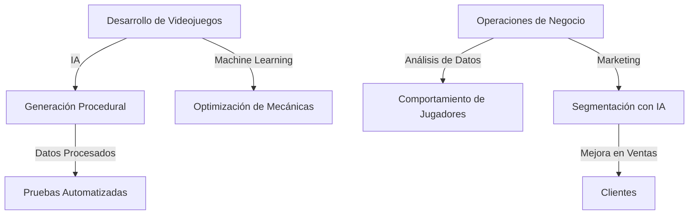

# PIXARDGAME

# SERGIO PICHARDO MELGAR
# Proyecto 1: Diseño de la Transformación Digital de un Sector mediante IA

## Introducción
La transformación digital está transformando drásticamente el modo en que las empresas operan hoy en día. En este proyecto, examinaremos cómo la digitalización, impulsada por la Inteligencia Artificial (IA), puede funcionar como un impulsor de la transformación en una compañía de un sector específico.

---

## Fundamentos teóricos
La digitalización puede ser categorizada en dos perspectivas fundamentales:  
  
- **Digitalización en desarrollo**: abarca los procesos de desarrollo de software, que comprenden aspectos de automatización de pruebas, gestión de versiones e implementación continua de software. 
- **Digitalización en el ámbito empresarial**: las funciones administrativas y de back-office incluyen análisis de datos, gestión de relaciones con los clientes (CRM) y mejora de las tácticas de venta.

---

## Desarrollo del proyecto

### 1. **Selecciona un sector y una empresa**
Para este proyecto, el sector escogido es la **industria de los videojuegos**, y la compañía seleccionada es una empresa ficticia: *PixardGame Studios*.  
  
**Características de las Estudios PixardGame:**  
- **Tamaño:** Corporación de magnitud media.  
- **Productos:** Videojuegos de origen indie y de alta calidad.  
- **Clientes:** Jugadores de diferentes edades, centrados en vivencias envolventes.  
- **Ríos presentes:** Perfeccionar la producción de videojuegos, potenciar la experiencia del usuario y robustecer la táctica de marketing.

### 2. **Tecnologías**

**Tecnologías utilizadas en el progreso:**  
1. Algoritmos de Inteligencia Artificial para la creación de contenido basado en procedimientos (universos, personajes, niveles).  
2. Instrumentos de aprendizaje automático para perfeccionar las estrategias de juego a partir de información de los participantes.  
  
**Tecnologías utilizadas en el ámbito empresarial:**  
1. Plataformas para el análisis de datos con el objetivo de entender el comportamiento usuario.  
2. Instrumentos de machine learning para optimizar las dinámicas de juego basándose en los datos de los jugadores.  
  
**Tecnologías utilizadas en el ámbito empresarial:**  
1. Sistemas de análisis de datos para comprender la conducta de los jugadores.
2. Tácticas de marketing potenciadas por la inteligencia artificial para una segmentación más efectiva de los clientes.  
3. Asistentes virtuales inteligentes destinados a proporcionar ayuda técnica.
  

### 3. **Crea un diagrama con Mermaid**
La estructura de IT (Tecnología de Información) y OT (Tecnología Operativa).

### 4. **Propuesta de transformación digital**

#### En desarrollo:
- Los algoritmos de inteligencia artificial permitirán la construcción de universos y niveles de juego de manera estructurada, maximizando la utilización de tiempo y recursos.  
- Las herramientas de aprendizaje automático modificarán las dinámicas del juego basándose en la información recabada de las sesiones de los jugadores.  

#### En negocio:
- Un sistema de análisis de datos facilitará la identificación de patrones en la conducta de los jugadores, permitiendo así la generación de contenido a medida.  
- Un chatbot inteligente proporcionará asistencia instantánea y eficiente a los jugadores, optimizando su experiencia global.

### 5. **Reflexión final**  
La inteligencia artificial está revolucionando la forma en que las compañías realizan sus operaciones, posibilitando procesos más eficientes, decisiones más basadas en datos y experiencias más ajustadas a las demandas de los clientes. 

